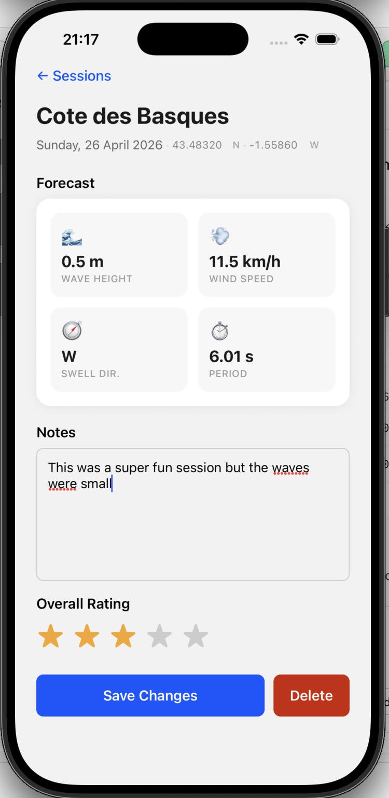
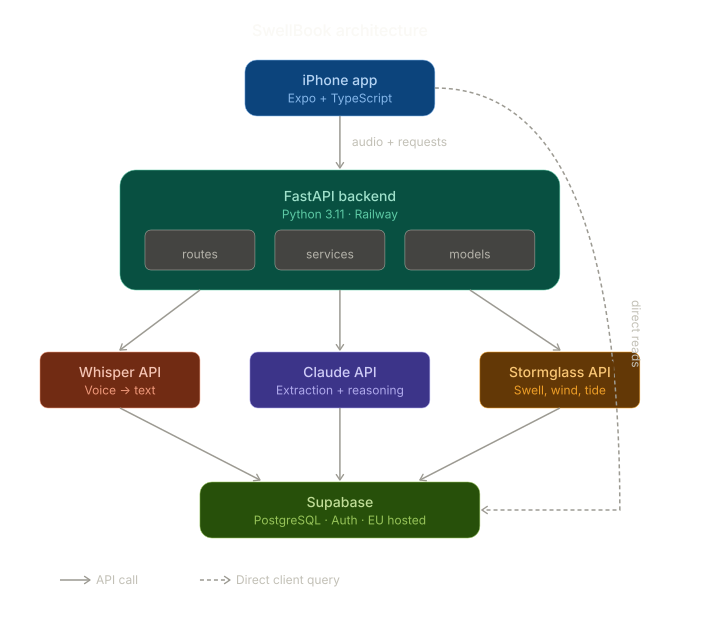

# 🌊 SwellBook

A personal surf session journal that learns how you experience the ocean.

Record voice memos after each session, and SwellBook extracts conditions, matches them against real forecast data, and builds your personal surf knowledge base over time. When you're wondering whether to paddle out, it cross-references current conditions with your history and tells you what to expect.




---

## How it works

**Log a session** — press record, describe your session out loud, done. SwellBook transcribes your voice, extracts structured data (spot, conditions, mood, rating), fetches the actual forecast for that moment, and stores everything. Over time, it builds a personal calibration layer — how *you* perceive conditions vs what the data says.

**Should I go?** — one tap. SwellBook checks current forecasts across your saved spots, finds your closest matching historical sessions, and gives you a plain-language recommendation grounded in your own experience.

---

## Tech stack

| Layer | Technology | Purpose |
|---|---|---|
| Mobile | Expo + React Native + TypeScript | iOS app with voice recording |
| Backend | FastAPI + Python 3.11 | API orchestration |
| Database | Supabase (PostgreSQL) | Session storage, auth |
| Transcription | Whisper API | Voice → text |
| AI reasoning | Claude API | Extraction + recommendations |
| Ocean data | Stormglass API | Swell, wind, tide forecasts |
| Hosting | Railway | Backend deployment |

## Project structure

```
swellbook/
├── app/                       ← Expo React Native (TypeScript)
│   └── src/
│       ├── features/          ← domain-driven modules
│       │   ├── session/       ← session display and history
│       │   ├── recorder/      ← voice recording
│       │   ├── forecast/      ← forecast display
│       │   └── spots/         ← spot management
│       ├── shared/            ← reusable components, hooks, utils
│       ├── navigation/        ← app navigation
│       └── config/            ← supabase client, env config
├── backend/                   ← FastAPI (Python 3.11)
│   └── app/
│       ├── routes/            ← thin HTTP handlers
│       ├── services/          ← business logic (whisper, claude, stormglass)
│       └── models/            ← pydantic schemas
├── .claude/                   ← Claude Code configuration
│   ├── settings.json          ← permissions, hooks
│   ├── rules/                 ← code style and security rules
│   ├── agents/                ← subagent definitions
│   └── skills/                ← reusable workflow templates
├── CLAUDE.md                  ← project context for Claude Code
├── .mcp.json                  ← MCP server config (Supabase)
└── .claudeignore              ← files hidden from Claude Code
```

## Core workflows

### 1. Save a session

```
Voice memo → Whisper (transcription) → Claude (extraction) → Stormglass (actual conditions) → Supabase (storage)
```

### 2. Get a recommendation

```
Current forecast (all spots) → Historical session matching (SQL) → Claude (cross-spot reasoning) → Ranked recommendation
```


## Architecture



## Setup

### Prerequisites

- Node.js 18+
- Python 3.11
- iPhone with Expo Go installed
- API keys: Supabase, OpenAI, Anthropic, Stormglass

### Backend

```bash
cd backend
pyenv local 3.11.10
python -m venv .venv
source .venv/bin/activate
pip install -r requirements.dev.txt
cp .env.example .env  # fill in your API keys
uvicorn app.main:app --reload
```

### Frontend

```bash
cd app
npm install
cp .env.example .env  # fill in your public keys
npx expo start
# scan QR code with iPhone camera
```

### Environment variables

Copy `.env.example` in both `backend/` and `app/` and fill in your keys. See each file for required variables. Never commit `.env` files.

---

## Built with Claude Code

This project uses Claude Code extensively for development. The `.claude/` directory contains the full configuration: permissions, hooks for auto-formatting, code style rules, subagents for feature building, and MCP integration with Supabase.

---

*Built in Paris, tested in Biarritz.* 🏄